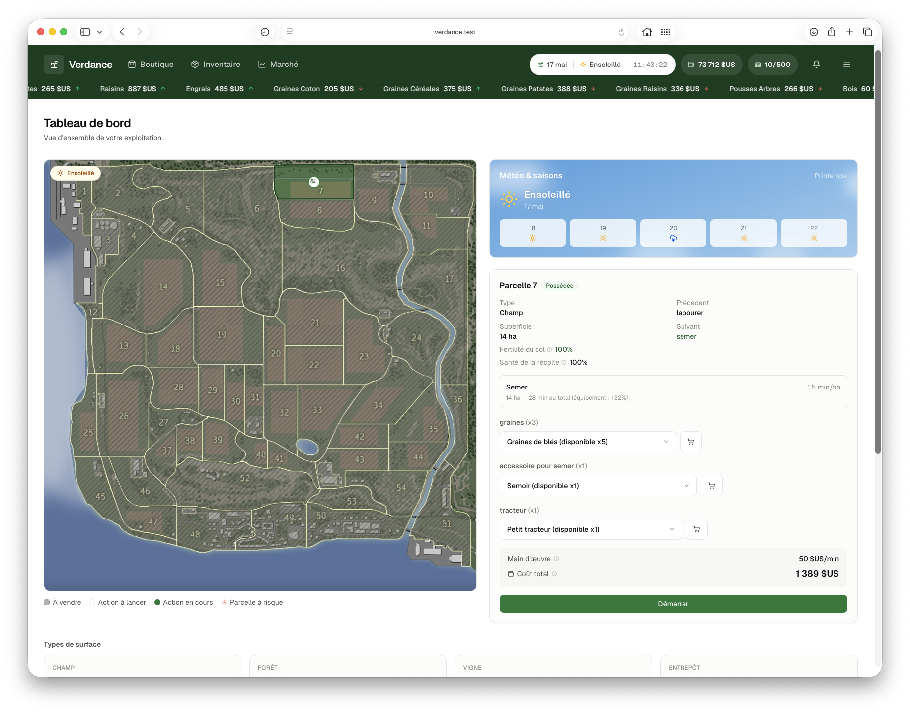

<h1 align="center">
  <br>
  🚜 Verdance - Simulateur d'exploitation agricole
  <br>
</h1>

<h4 align="center">Simulateur de gestion agricole : parcelles, actions temporisées, boutique, inventaire et marché dynamique, avec une carte interactive.</h4>




## Stack

- **Frontend** : Next.js (App Router) + TypeScript + Tailwind CSS — `frontend/`
- **Backend** : FastAPI + SQLAlchemy — `backend/app/`
- **Base de données** : PostgreSQL
- Tout tourne via **Docker Compose**

## Démarrer

```bash
docker compose up --build -d
```

L'app tourne derrière **Caddy** (reverse proxy), qui route un nom d'hôte local vers le frontend et
`/api/*` vers le backend — un seul point d'entrée, pas de CORS à gérer manuellement.

1. Ajoute une fois `127.0.0.1 verdance.test` à `/etc/hosts` (nécessite `sudo`) :
   ```bash
   sudo sh -c 'echo "127.0.0.1 verdance.test" >> /etc/hosts'
   ```
2. Ouvre **http://verdance.test**

